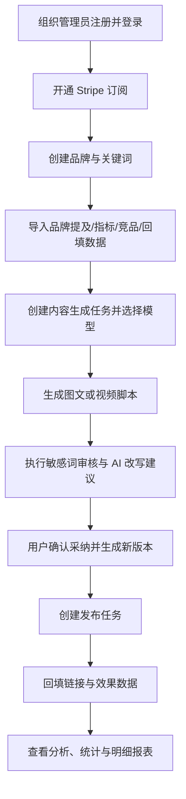

# GEO 企业版运营平台 PRD

## 1. 产品概述
面向 ToB 企业运营团队的 GEO 全流程运营平台，采用 PC 优先、响应式适配的工作台形态，覆盖数据导入、内容生成、审核、发布任务、回填分析、成员与订阅管理。

- 解决问题：把分散的品牌监测、内容生产、敏感词审核、发布跟踪、效果分析统一到一个组织级 SaaS 平台中
- 目标用户：企业管理员、运营成员、编辑、分析人员
- 商业目标：通过订阅门槛 + AI Token 成本核算形成标准化 SaaS 收费模型
- 产品边界：MVP 先做任务管理与链接/数据回填，不做自动发布；监测与竞品数据先依赖手工导入

## 2. 核心功能

### 2.1 用户角色
| 角色 | 注册/加入方式 | 核心权限 |
|------|---------------|----------|
| Admin | 组织注册创建 / 被提升为管理员 | 订阅与账单、成员管理、AI Key 管理、导入导出、全量报表、系统设置 |
| Member | 受邀加入组织并设置密码 | 内容生成、审核、发布任务、回填、查看被授权数据 |
| Analyst | 受邀加入组织并设置密码 | 只读查看分析、统计、报表与明细 |

### 2.2 功能模块
1. **认证与订阅**：邮箱密码登录、首次设置密码、订阅开通、订阅状态校验
2. **控制台总览**：流程入口、关键 KPI、待办与异常提醒
3. **数据导入中心**：模板下载、CSV 导入、批次记录、失败行下载、覆盖策略
4. **品牌监测**：基于导入数据查看品牌提及、趋势、Top 来源、Top 关键词、异常峰值
5. **竞品洞察**：手工录入或导入竞品条目并做筛选分析
6. **内容生成引擎**：图文与视频脚本生成，支持模块默认模型与任务级模型覆盖
7. **内容审核**：敏感词命中高亮、AI 改写建议、用户确认后生成新版本
8. **发布任务管理**：创建发布任务、跟踪状态、手工回填链接与效果数据
9. **效果分析与报表**：按组织、品牌、平台、渠道等维度查看 KPI 和导出 CSV
10. **AI 平台管理**：AI Key、安全存储、模型可用性、模块默认模型配置
11. **成员与权限**：邀请成员、禁用、强制重置密码、角色控制
12. **系统设置**：组织信息、敏感词词库、基础参数配置

### 2.3 页面详情
| 页面名称 | 模块名称 | 功能描述 |
|-----------|----------|----------|
| `/login` | 登录表单 | 邮箱 + 密码登录，未登录访问控制台时自动跳转 |
| `/set-password` | 首次设置密码 | 邀请成员通过一次性链接设置密码并激活组织成员关系 |
| `/billing/subscribe` | 订阅开通 | 月付/年付套餐选择，未订阅组织进入核心功能前强制拦截 |
| `/billing` | 订阅状态 | 查看套餐、周期、状态、续费信息，MVP 先展示基础状态 |
| `/dashboard` | 运营总览 | 流程步骤卡片、KPI、待办、最近批次、异常提醒 |
| `/imports` | 导入中心 | 模板下载、四类导入入口、导入批次、错误明细下载 |
| `/brand-monitor` | 品牌监测 | 按品牌/平台/关键词/时间筛选并展示趋势和来源分布 |
| `/competitors` | 竞品洞察 | 管理竞品条目、筛选列表、指标概览 |
| `/content-engine` | 内容生成 | 任务创建、模型选择、生成结果、版本管理、资产保存 |
| `/review` | 内容审核 | 敏感词命中、替换建议、AI 改写建议、确认采纳生成 revision |
| `/publish` | 发布任务 | 创建任务、任务列表、详情、状态流转、回填 URL 与效果数据 |
| `/analytics` | 效果分析 | 曝光、收录、互动、线索、转化、ROI、Token 成本等聚合分析 |
| `/reports` | 明细报表 | 多维筛选、表格明细、CSV 导出 |
| `/ai-platforms` | AI 平台管理 | Key 配置、模型清单、模块默认模型、任务级覆盖策略说明 |
| `/accounts/members` | 成员管理 | 邀请、角色查看、禁用、强制重置 |
| `/statistics` | 数据统计中心 | 组织级汇总看板，聚合内容、导入、发布、AI 成本 |
| `/settings` | 系统设置 | 组织信息、敏感词词库、系统参数 |

## 3. 核心流程
管理员完成组织注册与订阅后，创建品牌并导入历史监测/指标数据；成员基于品牌、目标平台、关键词发起内容生成任务，选择模块默认模型或任务级覆盖模型；生成结果进入审核流，系统提示敏感词命中与 AI 改写建议，只有用户确认采纳后才生成新版本；运营再创建发布任务并回填发布链接和效果数据，最终在分析和报表中查看收录、曝光、线索、ROI 与 Token 成本。

## 4. 用户界面设计

### 4.1 设计风格
- 整体风格：企业级深色数据工作台，强调“流程闭环 + 数据可追溯”
- 主色：深石墨灰、墨蓝；辅助色：青蓝、青绿色，用于高亮进行中状态和增长趋势
- 危险/提醒色：琥珀黄、红色，用于敏感词、异常任务、失败批次
- 按钮风格：圆角中等、边界清晰、主操作实心、次操作描边
- 字体建议：标题使用有辨识度的中文黑体风格，正文使用系统无衬线中文字体，控制 4 级字号体系
- 布局风格：左侧主导航 + 顶部组织状态条 + 主内容双列/分区卡片
- 图标风格：使用 `lucide-react` 线性图标，搭配少量状态徽标
- 动效建议：页面进入轻微上移渐显，图表与流程卡片使用分段出现动画，按钮 hover 强调阴影与色差

### 4.2 页面设计总览
| 页面名称 | 模块名称 | UI 元素 |
|-----------|----------|----------|
| 登录/订阅 | 表单与方案卡 | 居中布局、品牌标题、套餐卡片、错误提示、表单反馈 |
| 总览 | KPI + 流程入口 | 顶部 KPI 栏、流程工作台、待办列表、最近导入/任务表格 |
| 导入中心 | 批次管理 | 类型切换 Tab、模板下载卡、上传区、批次表格、错误面板 |
| 内容生成 | 任务与结果 | 左侧参数面板、中部编辑与生成结果、右侧评分与建议 |
| 审核页面 | 风险确认 | 文本差异对比、敏感词高亮、建议卡片、确认采纳按钮 |
| 发布任务 | 列表与详情 | 状态筛选、任务卡/表格、详情抽屉、回填表单 |
| 分析/报表 | 图表与表格 | 趋势图、分布图、筛选条、数据表格、导出操作 |
| AI 平台/设置 | 配置中心 | 分区配置卡、密钥表单、词库表格、权限说明 |

### 4.3 响应式策略
- 采用桌面优先设计，目标分辨率优先覆盖 `1280px` 以上工作台场景
- `1024px` 以上保持左侧导航与多栏信息布局
- `768px` 到 `1023px` 收拢侧边栏为图标模式，关键表格转为卡片列表
- `768px` 以下保留基础可用性，但不作为 MVP 核心验收重点

### 4.4 参考站点映射结论
- 参考站点强调“全流程步骤感”，本产品保留流程工作台表达，但弱化夸张营销文案，强化企业后台可操作性
- 参考站点存在“素材解析、账号管理、发布管理、效果中心、AI 平台、系统设置”等模块，本产品将其映射为数据导入、内容生成、发布任务、分析中心、AI 平台与系统设置
- 参考站点偏单页宣传 + 模块页，本产品改为标准 SaaS 工作台路由结构，满足组织、权限、订阅、审计和数据隔离要求
