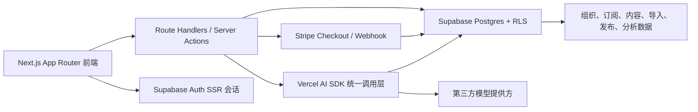
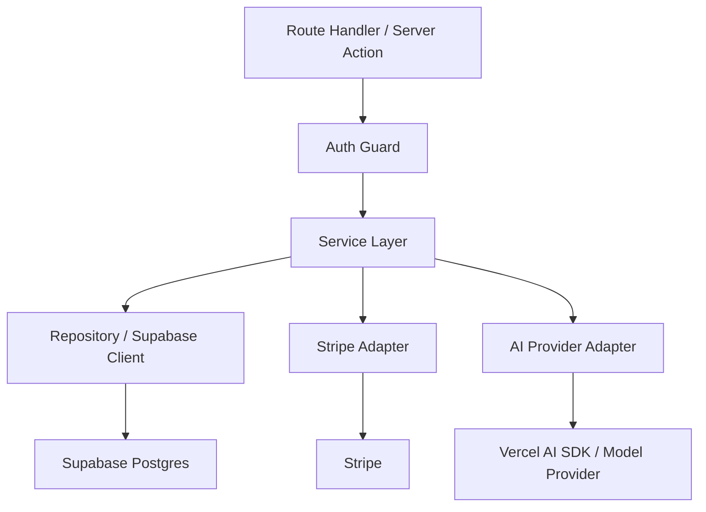
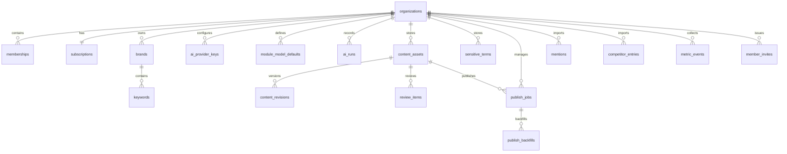

# GEO 企业版运营平台技术架构

## 1. 架构设计



## 2. 技术说明

* 前端：`Next.js App Router` + `TypeScript` + `Tailwind CSS` + `shadcn/ui`

* 身份与数据：`Supabase Auth` + `Supabase Postgres` + `RLS`

* 支付：`Stripe` 测试模式，使用 Checkout + Webhook 同步订阅状态

* AI：`Vercel AI SDK`，统一封装流式输出与结构化输出，并记录 `ai_runs`

* 校验：`Zod`

* 图表与表格：优先使用轻量图表组件与 `shadcn/ui` 表格组合

* 部署：Vercel 风格项目结构，服务端安全逻辑全部留在 Next.js 服务侧

## 3. 路由定义

| 路由                   | 用途         |
| -------------------- | ---------- |
| `/login`             | 邮箱密码登录     |
| `/set-password`      | 受邀成员首次设置密码 |
| `/billing/subscribe` | 订阅开通与拦截页   |
| `/billing`           | 当前订阅状态与周期  |
| `/dashboard`         | 总览与流程入口    |
| `/imports`           | 数据导入中心     |
| `/brand-monitor`     | 品牌监测       |
| `/competitors`       | 竞品洞察       |
| `/content-engine`    | 内容生成       |
| `/review`            | 内容审核       |
| `/publish`           | 发布任务管理     |
| `/analytics`         | 效果分析       |
| `/reports`           | 明细报表       |
| `/ai-platforms`      | AI 平台管理    |
| `/accounts/members`  | 成员管理       |
| `/statistics`        | 数据统计中心     |
| `/settings`          | 系统设置       |

## 4. API 定义

### 4.1 认证与成员

```ts
type InviteMemberRequest = {
  email: string;
  role: "admin" | "member" | "analyst";
};

type SetPasswordRequest = {
  token: string;
  newPassword: string;
};
```

| 接口                                  | 说明                |
| ----------------------------------- | ----------------- |
| `POST /api/members/invite`          | 创建邀请记录并发送首次设置密码链接 |
| `POST /api/auth/set-password`       | 校验邀请 token 并设置密码  |
| `POST /api/members/:id/disable`     | 禁用指定成员            |
| `POST /api/members/:id/force-reset` | 强制发送新的设置密码链接      |

### 4.2 订阅

```ts
type SubscribePlan = "month" | "year";

type SubscriptionState = {
  status: "active" | "past_due" | "canceled" | "unpaid";
  plan: SubscribePlan;
  currentPeriodStart: string | null;
  currentPeriodEnd: string | null;
};
```

| 接口                           | 说明                              |
| ---------------------------- | ------------------------------- |
| `POST /api/billing/checkout` | 创建 Stripe Checkout Session      |
| `POST /api/stripe/webhook`   | 接收 Stripe 事件并同步 `subscriptions` |

### 4.3 导入

```ts
type ImportType = "mentions" | "metric-events" | "competitors" | "publish-backfills";

type ImportBatchResult = {
  batchId: string;
  successRows: number;
  failedRows: number;
  failureFileUrl?: string;
};
```

| 接口                                 | 说明                 |
| ---------------------------------- | ------------------ |
| `POST /api/imports/:type`          | 上传、解析、校验、入库并返回批次结果 |
| `GET /api/imports/:batchId/errors` | 下载失败行              |

### 4.4 AI 与审核

```ts
type GenerateRequest = {
  module: "content-engine" | "review";
  taskId?: string;
  model?: string;
  brandId: string;
  platform: string;
  keywords: string[];
  contentType: "article" | "script";
};

type RewriteRequest = {
  assetId: string;
  revisionId: string;
  selectedTerms: string[];
  model?: string;
};
```

| 接口                      | 说明                          |
| ----------------------- | --------------------------- |
| `POST /api/ai/generate` | 生成图文/脚本，支持流式输出并记录 `ai_runs` |
| `POST /api/ai/rewrite`  | 返回改写建议，只有用户确认后才写入新 revision |

### 4.5 发布与分析

```ts
type PublishJobInput = {
  brandId: string;
  assetId: string;
  channelType: string;
  ownerUserId: string;
  scheduledAt?: string;
};

type PublishBackfillInput = {
  url: string;
  publishedAt: string;
  exposure?: number;
  engagement?: number;
  leads?: number;
  conversions?: number;
  roi?: number;
};
```

| 接口                                     | 说明                |
| -------------------------------------- | ----------------- |
| `POST /api/publish/jobs`               | 创建发布任务            |
| `PATCH /api/publish/jobs/:id/backfill` | 回填链接和效果数据，并补写指标事件 |

## 5. 服务端架构图



## 6. 数据模型

### 6.1 数据模型定义



### 6.2 数据定义语言

```sql
create table organizations (
  id uuid primary key,
  name text not null,
  owner_user_id uuid not null,
  created_at timestamptz not null default now()
);

create table memberships (
  id uuid primary key,
  organization_id uuid not null,
  user_id uuid not null unique,
  role text not null,
  status text not null,
  created_at timestamptz not null default now()
);

create table subscriptions (
  id uuid primary key,
  organization_id uuid not null unique,
  stripe_customer_id text,
  stripe_subscription_id text,
  status text not null,
  plan text not null,
  current_period_start timestamptz,
  current_period_end timestamptz,
  created_at timestamptz not null default now()
);

create table ai_runs (
  id uuid primary key,
  organization_id uuid not null,
  user_id uuid not null,
  module text not null,
  task_id uuid,
  model text not null,
  input_tokens integer not null default 0,
  output_tokens integer not null default 0,
  total_tokens integer not null default 0,
  cost numeric(12, 6) not null default 0,
  created_at timestamptz not null default now()
);
```

## 7. 关键实现约束

* 单邮箱单组织：`memberships.user_id` 唯一，禁止一个用户加入多个组织

* 单组织单订阅：`subscriptions.organization_id` 唯一

* 访问控制：`middleware` + 服务端 `guard` 双重校验登录、成员关系、订阅状态

* RLS：所有业务表必须带 `organization_id`，通过当前用户 membership 解析组织权限

* 管理权限：仅 `admin` 可管理成员、账单、AI Key、导出全量数据

* 审核确认：AI 改写建议只返回候选结果，必须由用户点击确认后才能写入 `content_revisions`

* 支付安全：Stripe 仅在服务端调用，Webhook 使用签名校验

* 密钥安全：AI Provider Key 仅服务端可读写，数据库中加密存储

## 8. 分阶段交付策略

* 阶段 1：项目初始化、认证、订阅、组织与成员、基础工作台骨架

* 阶段 2：导入中心、品牌监测、竞品洞察、内容生成与审核

* 阶段 3：发布任务、回填、分析中心、报表导出、统计中心

* 阶段 4：AI 平台管理、词库设置、审计日志、体验打磨与测试完善

